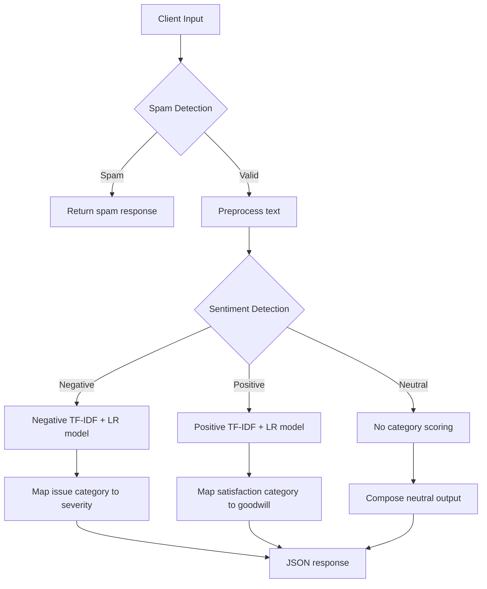
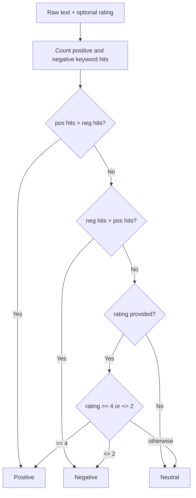
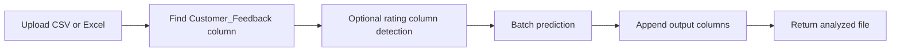
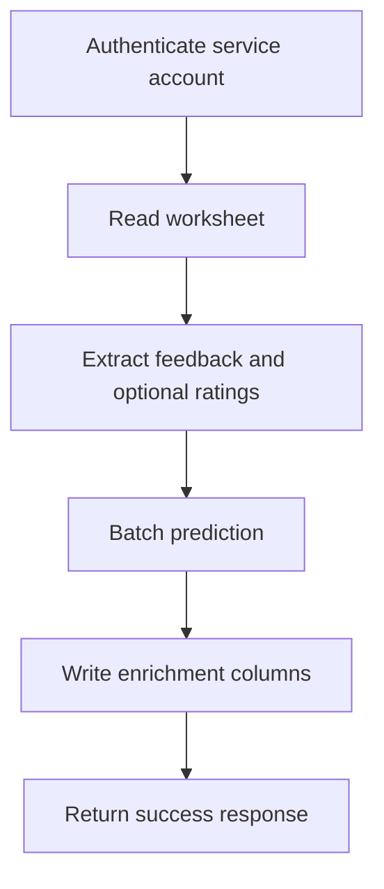
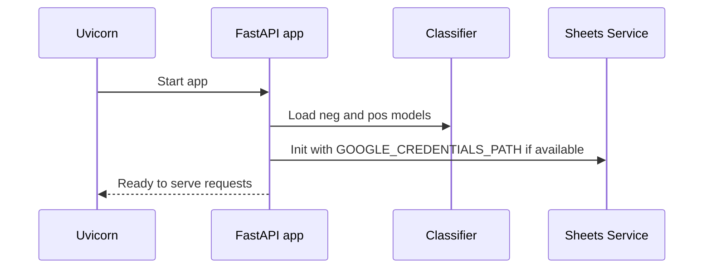

# Pipeline Flow Diagram

## High-Level Flow

```mermaid
flowchart TD
    A[Client Input] --> B{Spam Detection}
    B -->|Spam| C[Return spam response]
    B -->|Valid| D[Preprocess text]
    D --> E{Sentiment Detection}
    E -->|Negative| F[Negative TF-IDF + LR model]
    E -->|Positive| G[Positive TF-IDF + LR model]
    E -->|Neutral| H[No category scoring]
    F --> I[Map issue category to severity]
    G --> J[Map satisfaction category to goodwill]
    H --> K[Compose neutral output]
    I --> L[JSON response]
    J --> L
    K --> L
```

## Sentiment Decision Logic

```mermaid
flowchart TD
    A[Raw text + optional rating] --> B[Count positive and negative keyword hits]
    B --> C{pos hits > neg hits?}
    C -->|Yes| D[Positive]
    C -->|No| E{neg hits > pos hits?}
    E -->|Yes| F[Negative]
    E -->|No| G{rating provided?}
    G -->|No| H[Neutral]
    G -->|Yes| I{rating >= 4 or <= 2}
    I -->|>= 4| D
    I -->|<= 2| F
    I -->|otherwise| H
```

## File Upload Flow

```mermaid
flowchart LR
    A[Upload CSV or Excel] --> B[Find Customer_Feedback column]
    B --> C[Optional rating column detection]
    C --> D[Batch prediction]
    D --> E[Append output columns]
    E --> F[Return analyzed file]
```

## Google Sheets Flow

```mermaid
flowchart TD
    A[Authenticate service account] --> B[Read worksheet]
    B --> C[Extract feedback and optional ratings]
    C --> D[Batch prediction]
    D --> E[Write enrichment columns]
    E --> F[Return success response]
```

## Runtime Startup Sequence

```mermaid
sequenceDiagram
    participant U as Uvicorn
    participant A as FastAPI app
    participant C as Classifier
    participant S as Sheets Service

    U->>A: Start app
    A->>C: Load neg and pos models
    A->>S: Init with GOOGLE_CREDENTIALS_PATH if available
    A-->>U: Ready to serve requests
```

