# Complete Pipeline Flow Diagram

## 1. High-Level System Flow

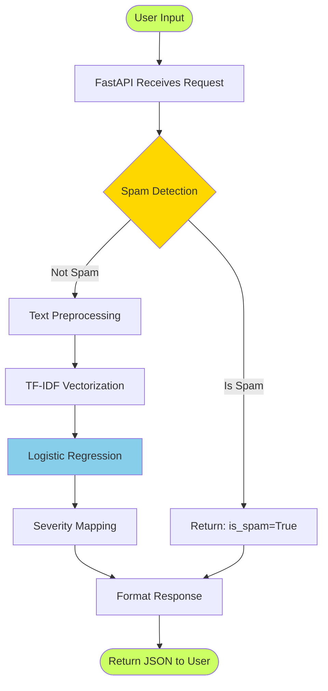

## 2. Detailed Text Processing Pipeline

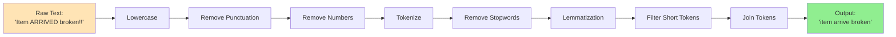

## 3. Complete End-to-End Flow with Details

```mermaid
flowchart TD
    subgraph Input Layer
        A1[User/Client] --> A2[HTTP POST Request]
        A2 --> A3{Request Type?}
        A3 -->|Single| B1[/predict]
        A3 -->|Batch| B2[/predict/batch]
        A3 -->|Sheets| B3[/sheets/update]
    end
    
    subgraph API Layer
        B1 --> C1[Validate Input]
        B2 --> C1
        B3 --> C1
        C1 --> C2{Model Loaded?}
        C2 -->|No| ERR1[Return 503 Error]
        C2 -->|Yes| D1[Extract Text]
    end
    
    subgraph Processing Layer
        D1 --> E1{Spam Check}
        E1 -->|Yes| E2[Mark as Spam]
        E1 -->|No| F1[Preprocess Text]
        F1 --> F2[Lowercase]
        F2 --> F3[Remove Punctuation]
        F3 --> F4[Tokenize]
        F4 --> F5[Remove Stopwords]
        F5 --> F6[Lemmatize]
        F6 --> F7[Clean Tokens]
        F7 --> G1[TF-IDF Vectorization]
        G1 --> G2[1000-D Vector]
        G2 --> H1[Logistic Regression]
        H1 --> H2[Predict Category]
        H2 --> H3[Get Confidence]
        H3 --> I1{Confidence > 0.4?}
        I1 -->|No| I2[Category: Uncertain]
        I1 -->|Yes| I3[Use Predicted Category]
        I2 --> J1[Severity Mapping]
        I3 --> J1
        E2 --> J1
    end
    
    subgraph Output Layer
        J1 --> K1[Build Response]
        K1 --> K2[Add Metadata]
        K2 --> K3[Serialize to JSON]
        K3 --> L1[Return HTTP 200]
    end
    
    L1 --> M1[Client Receives Response]
    ERR1 --> M1
    
    style E1 fill:#FFD700
    style H1 fill:#87CEEB
    style I1 fill:#FFD700
    style J1 fill:#98FB98
    style M1 fill:#CBFF63
```

## 4. Spam Detection Flow

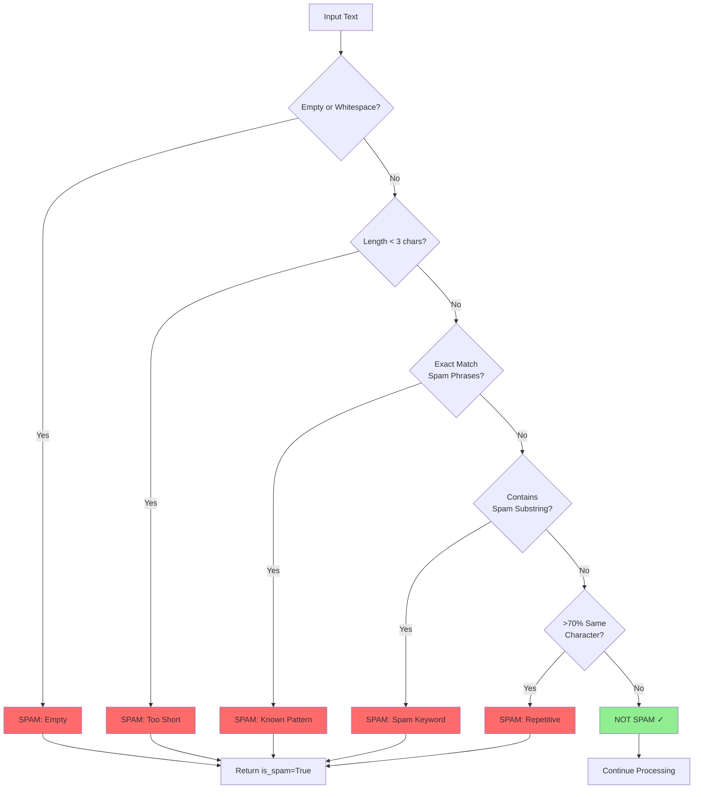

## 5. Machine Learning Classification Flow

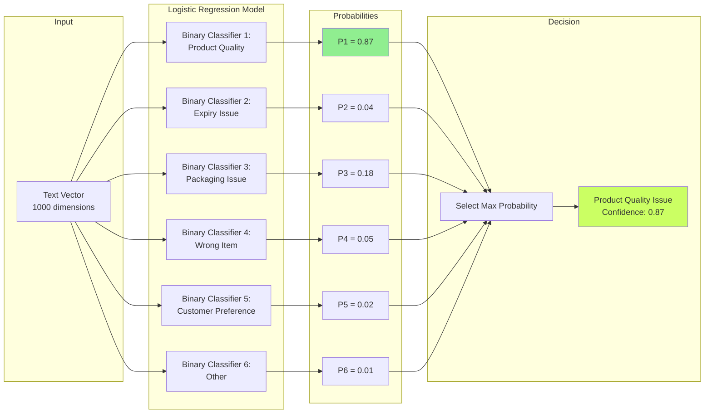

## 6. Batch Processing Workflow

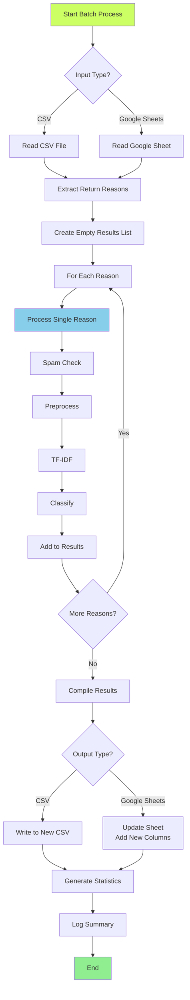

## 7. Google Sheets Integration Flow

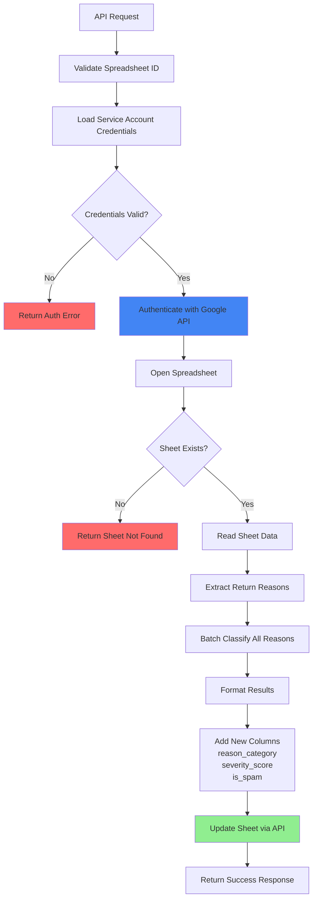

## 8. Training Pipeline

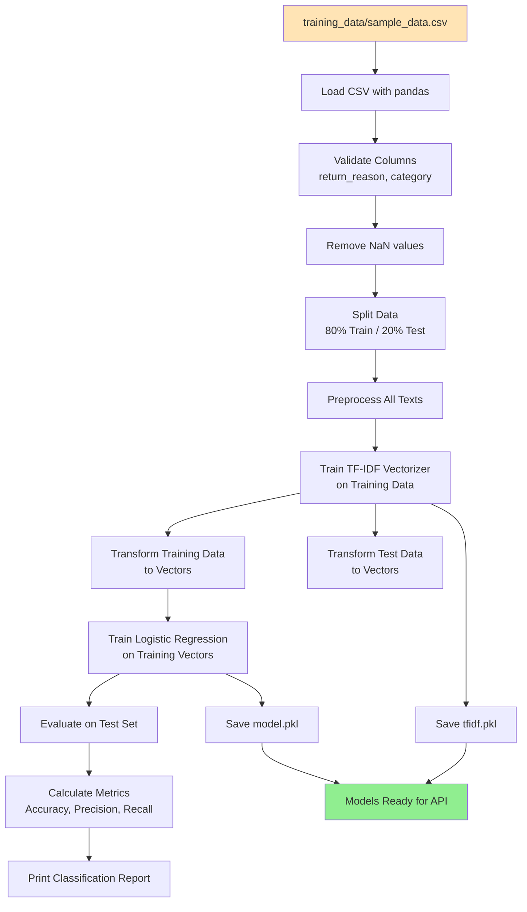

## 9. API Startup Sequence

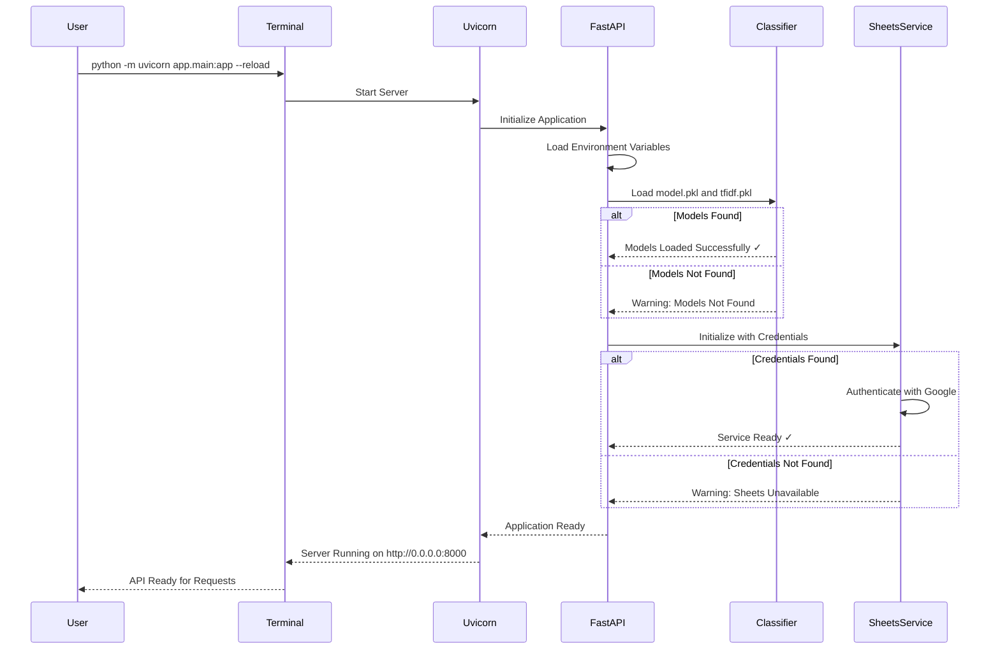

## 10. Single Prediction Request Flow

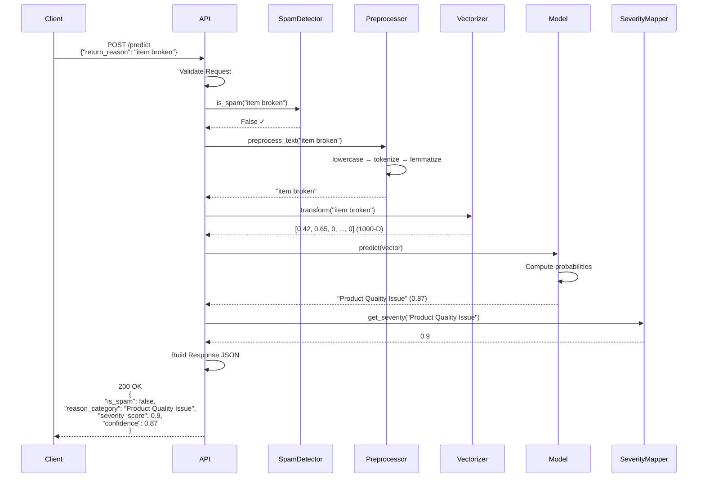

## 11. System Architecture Layers

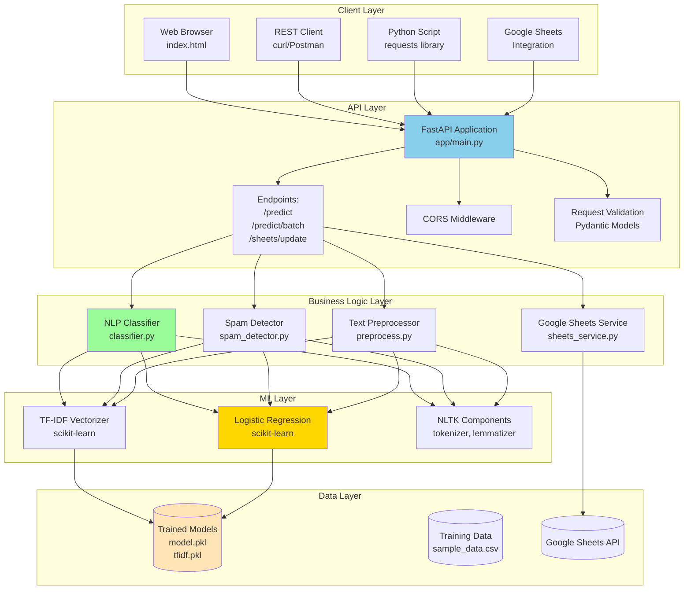

## 12. Data Flow - Single Prediction

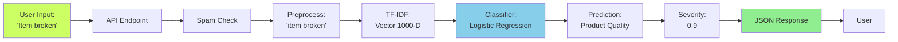

## 13. Component Interactions

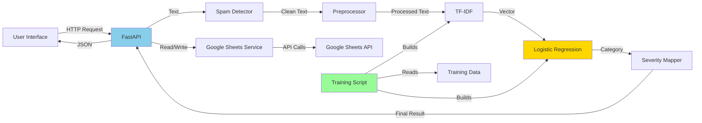

---

## Diagram Notes

### Mermaid Rendering

These diagrams use Mermaid syntax and can be rendered in:
- GitHub (native support)
- VS Code (with Mermaid extension)
- Online: https://mermaid.live/
- Documentation sites (GitBook, MkDocs, etc.)

### Color Legend

- 🟢 **Green (#90EE90)**: Success/Output
- 🔵 **Blue (#87CEEB)**: Processing/ML
- 🟡 **Yellow (#FFD700)**: Decision Points
- 🟠 **Orange (#FFE4B5)**: Input/Data
- 🔴 **Red (#FF6B6B)**: Errors/Spam
- 🟣 **Lime (#CBFF63)**: User Interface

---

*These diagrams provide visual representation of the system architecture and data flow. Use them alongside COMPLETE_DOCUMENTATION.md for full understanding.*
